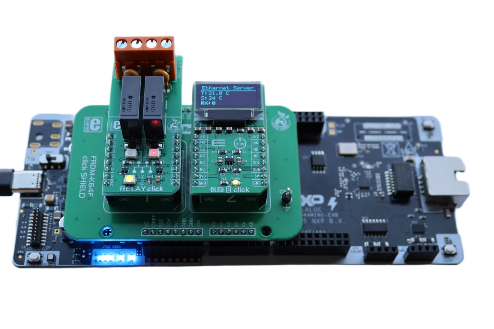
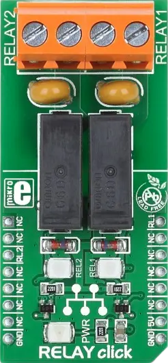
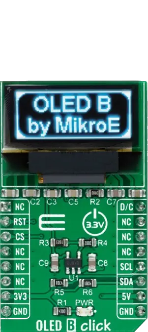
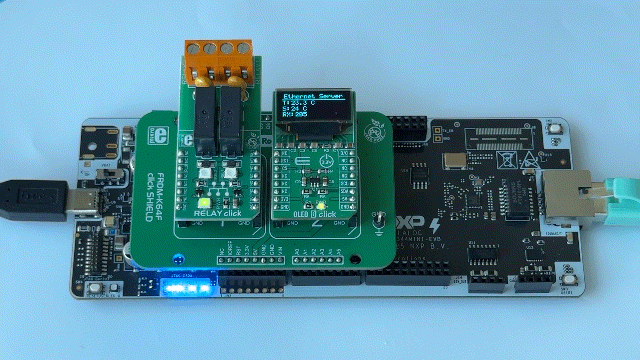

# NXP Application Code Hub

## Remote Controlled Relay over Ethernet
This example demonstrates a remotely controlled thermostat running on the FRDM-A-S32K344 evaluation board. Ambient temperature is acquired from a P3T1750DP sensor over the LPI2C interface and displayed on an SSD1306 OLED screen, while the LPUART peripheral periodically reports the current temperature to a host terminal. Based on a user-configurable setpoint with hysteresis, the application drives two GPIO-controlled relays for heating and cooling. The setpoint can be adjusted at runtime through simple HTTP commands issued from any web browser or `curl` client over the on-board Ethernet interface. This example showcases the S32K344 Ethernet, I2C, UART, and GPIO capabilities and serves as a foundation for industrial monitoring, automation, and remote relay control applications.
[

](./images/FRDM-A-S32K344_Ethernet_OLED_Relay.png)

#### Boards: FRDM-A-S32K344
#### Categories: Networking, Sensor
#### Peripherals: ETHERNET, I2C, GPIO, UART
#### Toolchains: S32 Design Studio IDE

## Table of Contents
1. [Software and Tools](#step1)
2. [Hardware](#step2)
3. [Setup](#step3)
4. [Results](#step4)
5. [Support](#step6)
6. [Release Notes](#step7)

## 1. Software and Tools
### 1.1 FRDM Automotive Bundle for S32K3
This example was developed using the FRDM Automotive Bundle for S32K3 + S32M27. To download and install the complete software and tools ecosystem, use the following link:
- [ FRDM Automotive S32K3 + S32M27 Board Installation Package](https://www.nxp.com/app-autopackagemgr/automotive-software-package-manager:AUTO-SW-PACKAGE-MANAGER?currentTab=0&selectedDevices=S32K3&applicationVersionID=203)

## 2. Hardware
### 2.1 Required Hardware
- Personal Computer
- Type-C USB cable
- UTP/FTP CAT 5e Ethernet cable

| Boards | Images |
| ----------- | ------- |
| - [FRDM-A-S32K344](https://www.nxp.com/design/design-center/development-boards-and-designs/FRDM-A-S32K344) |  |
| - [FRDM K64 click shield](https://www.mikroe.com/frdm-k64-click-shield) | 
 |
| - [Relay Click](https://www.mikroe.com/relay-click)   - [Oled B Click](https://www.mikroe.com/oled-b-click) | 
   |

### 2.2 Hardware Connections

**Force Click (MikroBUS slot 1)**

| FRDM-A-S32K344   | Header Pin | I/O | FRDM Shield  | Click Board  | Click Pin | Description  |
|------------------|------------|-----|--------------|--------------|-----------|--------------|
| GND              | JA3 pin 13 | →   | GND          | Relay Click  | GND       | Ground       |
| VDD_PERH         | JA3 pin 7  | →   | 3.3V         | Relay Click  | 3V3       | Power Supply |
| PTB17            | J2 pin 5   | →   | D10          | Relay Click  | RL2       | GPIO         |
| PTA1             | JA1 pin 17 | →   | D6           | Relay Click  | RL1       | GPIO         |

**OLED B Click (MikroBUS slot 2)**

| FRDM-A-S32K344   | Header Pin |I/O| FRDM Shield  | Click Board    | Click Pin | Description  |
|------------------|------------|---|--------------|----------------|-----------|--------------|
| PTA3 GPIO        | JA1 pin 11 | ← | D5           | OLED B Click   | D/C       | I2C Slave Address Selection Pin|
| PTA13 GPIO       | J4 pin 5   | ← | A2           | OLED B Click   | RST       | Reset Pin    |
| PTC10 GPIO       | J2 pin 3   | ← | D9           | OLED B Click   | CS        | Communication Enable Pin|
| PTA14 FlexIO_D3  | J4 pin 11  | → | A4           | OLED B Click   | SDA       | FlexIO I2C SDA Pin  |
| PTE0 FlexIO_D14  | J4 pin 9   | → | A5           | OLED B Click   | SCL       | FlexIO I2C SCL Pin  |
| GND              | JA3 pin 11 | → | GND          | OLED B Click   | GND       | Ground       |
| VDD_PERH         | JA3 pin 7  | → | 3.3V         | OLED B Click   | 3V3       | Power Supply |

### 2.3 Debugger Connection
- Connect the Type-C USB cable to PC and FRDM-A-S32K344 board for power supply and debugging

## 3. Setup

### 3.1 Import the Project into S32 Design Studio IDE
1. Open S32 Design Studio IDE, in the Dashboard Panel, choose **Import project from Application Code Hub**.
[

](./images/import_project_1.png)

2. You can find the demo you need by searching for the name directly. Open the project, click the **GitHub** link from this window, S32 Design Studio IDE will automatically retrieve project attributes then click **Next>**.
[

](./images/import_project_3.png)

3. Select **main** branch and then click **Next>**.
4. Select your local path for the repo in **Destination->Directory** window. The S32 Design Studio IDE will clone the repo into this path, click **Next>**.

5. Select **Import existing Eclipse projects** then click **Next>**.

6. Select the project in this repo (only one project in this repo) then click **Finish**.

### 3.2 Generating, Building and Running the Example
1. In Project Explorer, right-click the project and select **Update Code and Build Project**. This will generate the configuration (Pins, Clocks, Peripherals), update the source code and build the project using the active configuration (e.g. Debug_FLASH).
Make sure the build completes successfully and the *.elf file is generated without errors.
[

](./images/update_and_build.png)
Press **Yes** in the **SDK Component Management** pop-up window to continue.

2. Go to **Debug** and select **Debug Configurations**. There will be a debug configuration for this project:
[

](./images/Debug_config.png)

        Configuration Name                  Description
        -------------------------------     -----------------------
        $(example)_debug_flash_pemicro      Debug the FLASH configuration using PEmicro probe

    Select the desired debug configuration and click on **Debug**. Now the perspective will change to the **Debug Perspective**.
    Use the controls to control the program flow.

    Before starting the debug session, connect the Ethernet cable between the target PC and the board and configure a static IP address for your network interface using the following settings:

    | Parameter      | Value          |
    |:--------------:|:--------------:|
    | PC IP          | 192.168.0.100  |
    | Subnet Mask    | 255.255.255.0  |
    | Default gateway| Not required   |

3. Once the board is running, test the HTTP server from the PC using the `curl` command-line tool, for example `curl http://192.168.0.101`.

> **Note - use `curl` instead of a web browser**
>
> Testing this example with `curl` on the command line is strongly recommended. Web browsers open multiple simultaneous TCP connections and perform retransmissions, which can interfere with the expected single-command behavior. Using `curl` issues one request per command and produces the intended relay response.

## 4. Results
Once the firmware is running and the board is connected to the PC via an Ethernet cable, the following behavior is expected:

[

](./images/FRDM-A-S32K344_Ethernet_OLED_Relay_Result.gif)

- The **SSD1306 OLED display** shows a live dashboard with:
  - **T:** - current temperature from the P3T1750DP sensor (in degrees Celsius)
  - **S:** - the active thermostat setpoint (in degrees Celsius)
  - **RX:** - count of received Ethernet frames, incrementing on each ping or HTTP request
- The board responds to **ARP** and **ICMP ping** requests (verify connectivity with `ping 192.168.0.101`).
- The **LPUART console** periodically prints the current temperature reading, for example `Temp: 23.5000 C`.
- The board answers HTTP requests on port 80. Use `curl http://192.168.0.101` to retrieve the status page.
- The following HTTP commands control the thermostat setpoint and the on-board LED:
  - `curl http://192.168.0.101/command1` - **increases** the thermostat setpoint by 1 degree Celsius.
  - `curl http://192.168.0.101/command2` - **decreases** the thermostat setpoint by 1 degree Celsius.
  - `curl http://192.168.0.101/command3` - **toggles** the on-board green LED.
- **Relay behavior** (based on measured temperature vs. configured setpoint with 1 degree hysteresis):
  - When the temperature drops below `setpoint - 1 C`: **RL1 (heating relay) activates**, RL2 turns off.
  - When the temperature rises above `setpoint + 1 C`: **RL2 (cooling relay) activates**, RL1 turns off.
  - Within the neutral band: both relays are off.

Debug counters (`Eth_ArpRequestsRx`, `Eth_ArpRepliesTx`, `Eth_IcmpRequestsRx`, `Eth_IcmpRepliesTx`) can be observed as watch-point expressions in S32 Design Studio to verify ARP and ICMP traffic without additional instrumentation.

## 5. Support
For general technical questions related to NXP microcontrollers, please use the *[NXP Community Forum](https://community.nxp.com/)*.

#### Project Metadata

<!----- Boards ----->

<!----- Categories ----->

<!----- Peripherals ----->

<!----- Toolchains ----->

Questions regarding the content/correctness of this example can be entered as Issues within this GitHub repository.

>**Note**: For more general technical questions regarding NXP Microcontrollers and the difference in expected functionality, enter your questions on the [NXP Community Forum](https://community.nxp.com/)

## 6. Release Notes
| Version | Description / Update                           | Date                           |
|:-------:|------------------------------------------------|-------------------------------:|
| 1.0     | Initial release on Application Code Hub        | September 10th 2026 |
